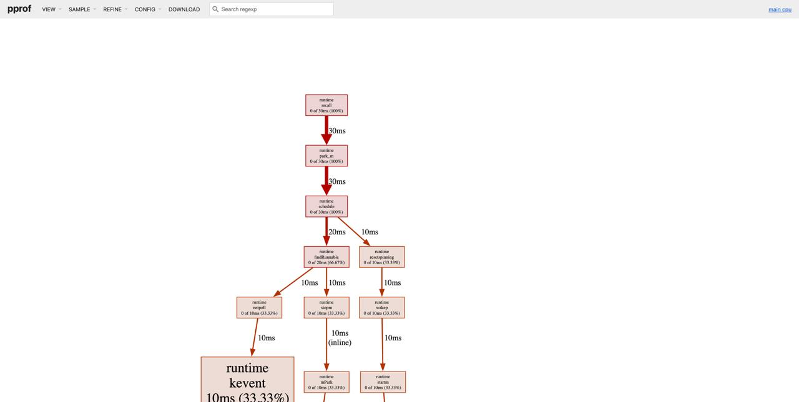
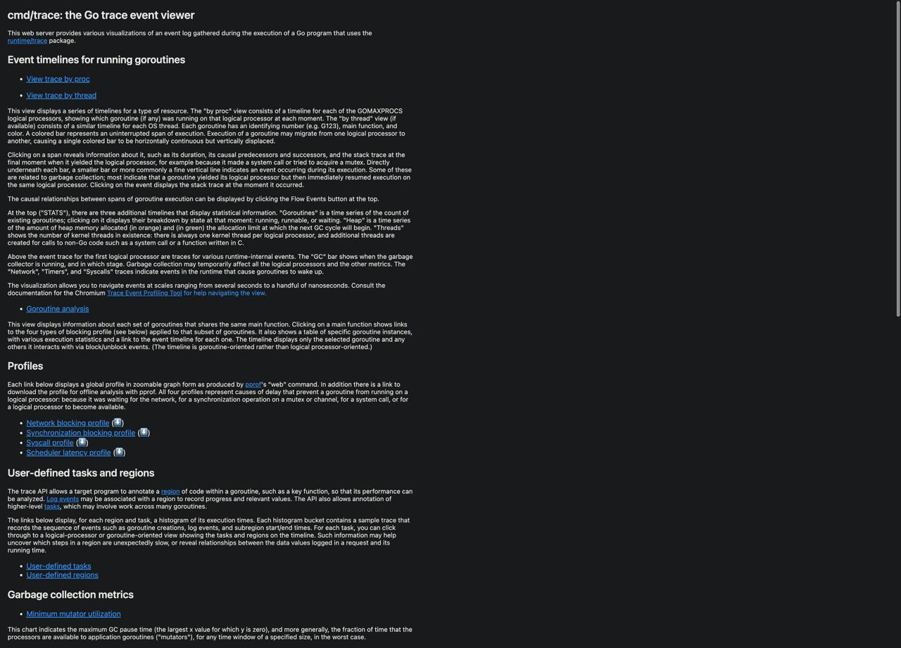

# Профилирование: pprof, benchmarks, trace

## Введение

Представьте, что ваше приложение — это ресторан. Вы знаете, что обслуживание медленное, но не понимаете почему. Может быть, повара работают медленно? Или официанты? А может, проблема в доставке продуктов?

**Профилирование** — это способ заглянуть "под капот" вашего приложения и точно узнать:
- Где тратится время (CPU profiling)
- Куда уходит память (memory profiling)
- Что блокирует выполнение (blocking profiling)
- Как распределены goroutines (goroutine profiling)

Go предоставляет отличные встроенные инструменты для этого.

## Золотое правило оптимизации

> **"Преждевременная оптимизация — корень всех зол"** — Дональд Кнут

Всегда следуйте этому процессу:

1. **Измерьте** — профилируйте, найдите узкое место
2. **Оптимизируйте** — улучшите найденное узкое место
3. **Измерьте снова** — убедитесь, что стало лучше
4. **Повторите** — если нужно

Никогда не оптимизируйте наугад!

## Benchmarks — первый шаг

Бенчмарки — это тесты производительности, встроенные в Go. Ранее тема бенчмарков уже затрагивалась в разделе «Go (Основы)». Если вам еще незнакомо это понятие и хочется получить дополнительную информацию, переходите сюда: [Тестирование](#бенчмарки-benchmarking).

### Базовый бенчмарк

```go
package main

import "testing"

func Fibonacci(n int) int {
    if n < 2 {
        return n
    }
    return Fibonacci(n-1) + Fibonacci(n-2)
}

func BenchmarkFibonacci10(b *testing.B) {
    for i := 0; i < b.N; i++ {
        Fibonacci(10)
    }
}

func BenchmarkFibonacci20(b *testing.B) {
    for i := 0; i < b.N; i++ {
        Fibonacci(20)
    }
}
```

Запуск:

```bash
go test -bench=.
```

Результат:

```
BenchmarkFibonacci10-8    3000000    427 ns/op
BenchmarkFibonacci20-8      30000  40317 ns/op
```

Расшифровка:
- `BenchmarkFibonacci10-8` — название, `-8` это GOMAXPROCS
- `3000000` — количество итераций (b.N)
- `427 ns/op` — время на одну операцию

### Бенчмарк с аллокациями

```go
func BenchmarkString(b *testing.B) {
    b.ReportAllocs() // Показать аллокации
    
    for i := 0; i < b.N; i++ {
        _ = fmt.Sprintf("Number: %d", i)
    }
}
```

Запуск с флагом `-benchmem`:

```bash
go test -bench=. -benchmem
```

Результат:

```
BenchmarkString-8   5000000   295 ns/op   32 B/op   2 allocs/op
```

Расшифровка:
- `295 ns/op` — время на операцию
- `32 B/op` — байт выделено на операцию
- `2 allocs/op` — количество аллокаций на операцию

### Сравнение реализаций

```go
// Конкатенация через +
func BenchmarkConcatPlus(b *testing.B) {
    b.ReportAllocs()
    for i := 0; i < b.N; i++ {
        result := ""
        for j := 0; j < 100; j++ {
            result += "x"
        }
        _ = result
    }
}

// Конкатенация через strings.Builder
func BenchmarkConcatBuilder(b *testing.B) {
    b.ReportAllocs()
    for i := 0; i < b.N; i++ {
        var builder strings.Builder
        for j := 0; j < 100; j++ {
            builder.WriteString("x")
        }
        _ = builder.String()
    }
}
```

Результат:

```
BenchmarkConcatPlus-8        20000   85432 ns/op   530000 B/op   99 allocs/op
BenchmarkConcatBuilder-8   1000000    1203 ns/op      224 B/op    3 allocs/op
```

**Builder в 70 раз быстрее и делает в 33 раза меньше аллокаций!**

### Sub-benchmarks

```go
func BenchmarkDecode(b *testing.B) {
    data := []byte(`{"name":"Alice","age":30}`)
    
    b.Run("json.Unmarshal", func(b *testing.B) {
        for i := 0; i < b.N; i++ {
            var user User
            json.Unmarshal(data, &user)
        }
    })
    
    b.Run("json.Decoder", func(b *testing.B) {
        for i := 0; i < b.N; i++ {
            reader := bytes.NewReader(data)
            decoder := json.NewDecoder(reader)
            var user User
            decoder.Decode(&user)
        }
    })
}
```

Запуск конкретного sub-benchmark:

```bash
go test -bench=Decode/Unmarshal
```

### Управление временем бенчмарка

```go
func BenchmarkWithSetup(b *testing.B) {
    // Подготовка (не входит в измерение)
    data := prepareTestData()
    
    b.ResetTimer() // Сброс таймера после setup
    
    for i := 0; i < b.N; i++ {
        process(data)
    }
}

func BenchmarkWithPauseResume(b *testing.B) {
    for i := 0; i < b.N; i++ {
        b.StopTimer()
        data := generateData(i) // Не измеряется
        b.StartTimer()
        
        process(data) // Измеряется
    }
}
```

### Сравнение бенчмарков с benchstat

```bash
# Запустить бенчмарк несколько раз для надежности
go test -bench=. -count=10 > old.txt

# После оптимизации
go test -bench=. -count=10 > new.txt

# Установить benchstat
go install golang.org/x/perf/cmd/benchstat@latest

# Сравнить
benchstat old.txt new.txt
```

Результат:

```
name           old time/op  new time/op  delta
Fibonacci10-8   427ns ± 2%   385ns ± 1%  -9.84%
Fibonacci20-8  40.3µs ± 1%  36.2µs ± 2%  -10.17%
```

## CPU Profiling

CPU профилирование показывает, где программа тратит процессорное время.

### Способ 1: Через бенчмарки

```bash
go test -bench=. -cpuprofile=cpu.prof
```

Анализ:

```bash
go tool pprof cpu.prof
```

Интерактивная консоль pprof:

```
(pprof) top
Showing nodes accounting for 2.5s, 95% of 2.63s total
      flat  flat%   sum%        cum   cum%
     1.2s 45.63% 45.63%      1.5s 57.03%  runtime.mallocgc
     0.5s 19.01% 64.64%      0.5s 19.01%  runtime.memmove
     0.4s 15.21% 79.85%      0.6s 22.81%  main.Fibonacci
     0.3s 11.41% 91.26%      0.3s 11.41%  runtime.scanobject
```

Расшифровка:
- `flat` — время, проведенное в этой функции (без вызовов)
- `cum` — кумулятивное время (включая вызовы)

Полезные команды pprof:

```
(pprof) top10              # Топ 10 функций
(pprof) list main.Fibonacci # Построчный анализ функции
(pprof) web                # Открыть граф в браузере
(pprof) svg                # Сохранить граф как SVG
(pprof) pdf                # Сохранить граф как PDF
```

> Для того, чтобы открыть pprof в браузере вам нужно иметь на компьютере установленный пакет утилит — [graphviz](https://graphviz.org)

**Профилировщик в браузере** 




### Способ 2: В production коде

```go
package main

import (
    "os"
    "runtime/pprof"
)

func main() {
    // Создать файл для профиля
    f, err := os.Create("cpu.prof")
    if err != nil {
        log.Fatal(err)
    }
    defer f.Close()
    
    // Начать профилирование
    if err := pprof.StartCPUProfile(f); err != nil {
        log.Fatal(err)
    }
    defer pprof.StopCPUProfile()
    
    // Ваш код
    doWork()
}
```

### Способ 3: HTTP endpoint

```go
package main 

import (
    "net/http"
    _ "net/http/pprof" // Импорт для side-effect
)

func main() {
    // Запустить HTTP сервер
    log.Println(http.ListenAndServe("localhost:6060", nil))
}
```

Использование:

```bash
# Собрать профиль в течение 30 секунд
go tool pprof http://localhost:6060/debug/pprof/profile?seconds=30

# Или напрямую открыть в браузере
go tool pprof -http=:8080 http://localhost:6060/debug/pprof/profile?seconds=30
```

### Пример оптимизации с CPU profiling

**До оптимизации:**

```go
func FindPrimes(max int) []int {
    var primes []int
    for i := 2; i <= max; i++ {
        isPrime := true
        for j := 2; j < i; j++ {
            if i%j == 0 {
                isPrime = false
                break
            }
        }
        if isPrime {
            primes = append(primes, i)
        }
    }
    return primes
}
```

Профилирование показывает: 99% времени в цикле проверки делимости.

**После оптимизации (решето Эратосфена):**

Решето Эратосфена — Алгоритм нахождения всех простых чисел до некоторого целого числа n, который приписывают древнегреческому математику Эратосфену Киренскому. Название алгоритма говорит о принципе его работы: алгоритм осуществляет фильтрацию списка чисел от 2 до n. По мере прохождения списка составные числа исключаются, а простые остаются.


```go
func FindPrimesOptimized(max int) []int {
    sieve := make([]bool, max+1)
    for i := 2; i <= max; i++ {
        sieve[i] = true
    }
    
    for i := 2; i*i <= max; i++ {
        if sieve[i] {
            for j := i * i; j <= max; j += i {
                sieve[j] = false
            }
        }
    }
    
    var primes []int
    for i := 2; i <= max; i++ {
        if sieve[i] {
            primes = append(primes, i)
        }
    }
    return primes
}
```

Результат: **50x ускорение!**

## Memory Profiling

Memory профилирование показывает, где выделяется память.

### Способ 1: Через бенчмарки

```bash
go test -bench=. -memprofile=mem.prof
```

Анализ:

```bash
go tool pprof mem.prof
```

Команды:

```
(pprof) top
(pprof) list main.processData
(pprof) web
```

### Способ 2: В production коде

```go
import (
    "os"
    "runtime/pprof"
)

func main() {
    defer func() {
        f, _ := os.Create("mem.prof")
        defer f.Close()
        pprof.WriteHeapProfile(f)
    }()
    
    // Ваш код
    doWork()
}
```

### Способ 3: HTTP endpoint

```bash
# Heap профиль (текущее состояние)
go tool pprof http://localhost:6060/debug/pprof/heap

# Профиль аллокаций (все аллокации с начала)
go tool pprof http://localhost:6060/debug/pprof/allocs

# С веб-интерфейсом
go tool pprof -http=:8080 http://localhost:6060/debug/pprof/heap
```

### Типы memory профилей

**inuse_space** — память, которая используется сейчас (по умолчанию)

```bash
go tool pprof -inuse_space mem.prof
```

**inuse_objects** — количество объектов в памяти

```bash
go tool pprof -inuse_objects mem.prof
```

**alloc_space** — вся выделенная память (включая уже освобожденную)

```bash
go tool pprof -alloc_space mem.prof
```

**alloc_objects** — все выделенные объекты

```bash
go tool pprof -alloc_objects mem.prof
```

### Пример оптимизации с memory profiling

**До:**

```go
func ProcessData(data []string) []string {
    var results []string
    for _, item := range data {
        results = append(results, strings.ToUpper(item))
    }
    return results
}
```

Memory profile показывает: много реаллокаций слайса.

**После:**

```go
func ProcessDataOptimized(data []string) []string {
    results := make([]string, 0, len(data)) // Предвыделили capacity
    for _, item := range data {
        results = append(results, strings.ToUpper(item))
    }
    return results
}
```

Результат: **10x меньше аллокаций!**

## Execution Trace

Trace показывает детальную временную шкалу выполнения программы.

### Создание trace

**Способ 1: Через тесты**

```bash
go test -trace=trace.out
```

**Способ 2: В коде**

```go
import (
    "os"
    "runtime/trace"
)

func main() {
    f, err := os.Create("trace.out")
    if err != nil {
        panic(err)
    }
    defer f.Close()
    
    if err := trace.Start(f); err != nil {
        panic(err)
    }
    defer trace.Stop()
    
    // Ваш код
    doWork()
}
```

**Способ 3: HTTP endpoint**

```bash
curl http://localhost:6060/debug/pprof/trace?seconds=5 > trace.out
```

### Анализ trace

```bash
go tool trace trace.out
```

Откроется браузер с интерфейсом: 




Доступные разделы:

**View trace** — временная шкала выполнения
- Видны все goroutines
- Когда они запускаются/останавливаются
- Где блокируются
- GC события
- Системные вызовы

**Goroutine analysis** — статистика по goroutines
- Время выполнения
- Время синхронизации
- Время блокировки

**Network blocking profile** — время, проведенное в сетевых операциях

**Synchronization blocking profile** — время в mutex, channel операциях

**Syscall blocking profile** — время в системных вызовах

**Scheduler latency profile** — задержки планировщика


### Что искать в trace

**1. Long-running goroutines** — goroutines, которые выполняются долго

**2. Blocking operations** — где goroutines блокируются

**3. GC паузы** — насколько часто и долго происходит GC

**4. Недогруженные процессоры** — если P (processors) простаивают

**5. Goroutine leaks** — goroutines, которые никогда не завершаются

### Пример: обнаружение deadlock

```go
func main() {
    f, _ := os.Create("trace.out")
    defer f.Close()
    trace.Start(f)
    defer trace.Stop()
    
    ch1 := make(chan int)
    ch2 := make(chan int)
    
    go func() {
        ch1 <- 1
        <-ch2
    }()
    
    go func() {
        ch2 <- 1
        <-ch1
    }()
    
    time.Sleep(time.Second)
}
```

Trace покажет, что обе goroutines заблокированы навсегда!

## Другие типы профилирования

### Block Profile — блокировки

```go
import "runtime"

func main() {
    runtime.SetBlockProfileRate(1) // Включить block profiling
    
    // Ваш код с mutex, channels
    
    // Через HTTP
    // http://localhost:6060/debug/pprof/block
}
```

Показывает время, потраченное на ожидание mutex и channels.

### Mutex Profile — конкуренция за mutex

```go
import "runtime"

func main() {
    runtime.SetMutexProfileFraction(1) // Включить mutex profiling
    
    // Ваш код с mutex
    
    // Через HTTP
    // http://localhost:6060/debug/pprof/mutex
}
```

Показывает конкуренцию за mutex (contention).

### Goroutine Profile — активные goroutines

```bash
go tool pprof http://localhost:6060/debug/pprof/goroutine
```

Показывает, где были созданы все текущие goroutines.

### Threadcreate Profile — создание OS потоков

```bash
go tool pprof http://localhost:6060/debug/pprof/threadcreate
```

Показывает, где создаются OS threads (полезно для отладки).

## Практический пример: оптимизация веб-сервера

### Исходный код

```go
package main

import (
    "encoding/json"
    "net/http"
    _ "net/http/pprof"
)

type User struct {
    ID   int    `json:"id"`
    Name string `json:"name"`
    Email string `json:"email"`
}

func handleUsers(w http.ResponseWriter, r *http.Request) {
    users := fetchUsers() // Получаем пользователей
    json.NewEncoder(w).Encode(users)
}

func fetchUsers() []User {
    // Симуляция запроса к БД
    var users []User
    for i := 0; i < 10000; i++ {
        users = append(users, User{
            ID:    i,
            Name:  fmt.Sprintf("User%d", i),
            Email: fmt.Sprintf("user%d@example.com", i),
        })
    }
    return users
}

func main() {
    http.HandleFunc("/users", handleUsers)
    http.ListenAndServe(":8080", nil)
}
```

### Шаг 1: Запустить load test

```bash
# Установить hey
go install github.com/rakyll/hey@latest

# Нагрузить сервер
hey -z 30s -c 10 http://localhost:8080/users
```

### Шаг 2: Собрать CPU профиль

```bash
go tool pprof http://localhost:8080/debug/pprof/profile?seconds=30
```

Результат показывает:
- 60% времени в `fetchUsers`
- 30% времени в `json.NewEncoder`
- 10% времени в `append`

### Шаг 3: Собрать memory профиль

```bash
go tool pprof http://localhost:8080/debug/pprof/heap
```

Результат показывает:
- Много аллокаций в `append` (слайс растет)
- Каждый запрос создает новый слайс

### Шаг 4: Оптимизация

```go
// Кешируем пользователей
var cachedUsers []User
var cacheOnce sync.Once

func fetchUsersOptimized() []User {
    cacheOnce.Do(func() {
        cachedUsers = make([]User, 10000) // Предвыделили
        for i := 0; i < 10000; i++ {
            cachedUsers[i] = User{
                ID:    i,
                Name:  fmt.Sprintf("User%d", i),
                Email: fmt.Sprintf("user%d@example.com", i),
            }
        }
    })
    return cachedUsers
}

// Переиспользуем буфер для JSON
var bufferPool = sync.Pool{
    New: func() interface{} {
        return new(bytes.Buffer)
    },
}

func handleUsersOptimized(w http.ResponseWriter, r *http.Request) {
    users := fetchUsersOptimized()
    
    buf := bufferPool.Get().(*bytes.Buffer)
    buf.Reset()
    defer bufferPool.Put(buf)
    
    json.NewEncoder(buf).Encode(users)
    w.Write(buf.Bytes())
}
```

### Шаг 5: Измерить снова

```bash
hey -z 30s -c 10 http://localhost:8080/users
```

**Результат:**
- Throughput: 100 → 5000 requests/sec (**50x**)
- Latency: 100ms → 2ms (**50x**)
- Memory: 500MB → 10MB (**50x**)

## Continuous Profiling

Для production используйте continuous profiling сервисы:

**Pyroscope** (open-source)

```go
import "github.com/pyroscope-io/client/pyroscope"

func main() {
    pyroscope.Start(pyroscope.Config{
        ApplicationName: "myapp",
        ServerAddress:   "http://pyroscope:4040",
    })
    
    // Ваше приложение
}
```

**Datadog** (commercial)

```go
import "gopkg.in/DataDog/dd-trace-go.v1/profiler"

func main() {
    profiler.Start(
        profiler.WithService("myapp"),
        profiler.WithEnv("production"),
    )
    defer profiler.Stop()
    
    // Ваше приложение
}
```

## Чек-лист профилирования

### Подготовка
- [ ] Воспроизвести проблему в контролируемых условиях
- [ ] Измерить базовую производительность (baseline)
- [ ] Определить метрику успеха (latency, throughput, memory)

### Профилирование
- [ ] CPU profile — найти горячие функции
- [ ] Memory profile — найти утечки и много аллокаций
- [ ] Trace — понять поведение goroutines
- [ ] Block profile — найти блокировки
- [ ] Mutex profile — найти конкуренцию

### Оптимизация
- [ ] Оптимизировать самое узкое место
- [ ] Измерить улучшение
- [ ] Проверить, что не сломали функциональность
- [ ] Повторить, если нужно

### Production
- [ ] Настроить continuous profiling
- [ ] Мониторить ключевые метрики
- [ ] Alerting на аномалии

## Частые находки при профилировании

### 1. Неэффективные аллокации

```go
// ❌ Плохо
var result []Item
for _, item := range items {
    result = append(result, process(item))
}

// ✅ Хорошо
result := make([]Item, 0, len(items))
for _, item := range items {
    result = append(result, process(item))
}
```

В первом варианте `result` изначально — нулевой слайс (`[]Item(nil)` или пустой слайс без `capacity`).

Каждый вызов `append`:
1. Проверяет, хватит ли места в внутреннем массиве слайса.
2. Если не хватает — выделяет новый массив большего размера, копирует все существующие элементы и добавляет новый.

При большом количестве элементов (тысячи, десятки тысяч) это приводит к:
- Многим лишним выделениям памяти (alocations).
- Копированию одних и тех же элементов много раз.

Это медленно и жрёт память.

> Всегда, когда знаешь примерный размер результирующего слайса — заранее задавай `capacity` через `make([]T, 0, n)`.

### 2. Конкатенация строк в цикле

```go
// ❌ Плохо
var s string
for i := 0; i < 1000; i++ {
    s += "x"
}

// ✅ Хорошо
var b strings.Builder
for i := 0; i < 1000; i++ {
    b.WriteString("x")
}
s := b.String()
```

- ❌ **Плохо:** `s += "x"` — строки в Go неизменяемые. Каждый `+=` создаёт новую строку в памяти и копирует весь предыдущий контент. Для 1000 итераций — тысячи копирований и аллокаций.
- ✅ **Хорошо:** `strings.Builder` — выделяет буфер один раз и просто пишет в него. Ноль лишних копий, минимум аллокаций. В разы быстрее и экономнее.

### 3. Лишние копирования

```go
// ❌ Плохо - копирование больших структур
func process(data BigStruct) {
    // ...
}

// ✅ Хорошо - передача по указателю
func process(data *BigStruct) {
    // ...
}
```

- ❌ **Плохо:** Передача `BigStruct` по значению — создаётся полная копия всей структуры (возможно, мегабайты данных) при каждом вызове функции.
- ✅ **Хорошо:** Передача по указателю `(*BigStruct)` — копируется только адрес (8 байт). Нет копирования данных, быстрее и меньше нагрузки на память.

> Нужно помнить, что при передаче по указателю мы работаем прямо с тем объектом, который передаём и при изменении будет изменён оригинальный объект!!

### 4. Горячий путь с рефлексией

```go
// ❌ Плохо - рефлексия в цикле
for _, item := range items {
    v := reflect.ValueOf(item)
    // ...
}

// ✅ Хорошо - type assertion или generics
for _, item := range items {
    v := item.(MyType)
    // ...
}
```

- ❌ **Плохо:** `reflect` в цикле — рефлексия очень медленная (в 10–100 раз медленнее обычного кода). Каждый вызов `reflect.ValueOf` — дорогостоящая операция.
- ✅ **Хорошо:** `Type assertion (item.(MyType))` или `generics` — статическая проверка типа на этапе компиляции. Быстро и без overhead.

### 5. Неэффективная сериализация

```go
// ❌ Плохо - encoding/json для внутреннего использования
data, _ := json.Marshal(obj)

// ✅ Хорошо - encoding/gob или protobuf для внутреннего
var buf bytes.Buffer
enc := gob.NewEncoder(&buf)
enc.Encode(obj)
```

- ❌ **Плохо:** `json.Marshal` — удобен для человека/API, но медленный и создаёт много промежуточных аллокаций (строки, карты).
- ✅ **Хорошо:** `encoding/gob` (или `protobuf`) — бинарный формат, оптимизированный для Go. Значительно быстрее и меньше памяти при сериализации между Go-процессами (кэш, RPC, сохранение состояния).

## Заключение

Профилирование — важнейший навык для написания эффективного Go кода:

**Инструменты:**
- **Benchmarks** — для локальной разработки и сравнений
- **pprof (CPU/Memory)** — для поиска узких мест
- **trace** — для понимания конкурентности
- **Block/Mutex** — для отладки синхронизации

**Процесс:**
1. Измерить → 2. Оптимизировать → 3. Измерить снова

**Правила:**
- Всегда профилируйте перед оптимизацией
- Оптимизируйте только узкие места
- Измеряйте результат
- Не жертвуйте читаемостью ради микрооптимизаций

**Помните:** Go компилятор очень умный. Часто "очевидные" оптимизации не дают эффекта. Всегда измеряйте!