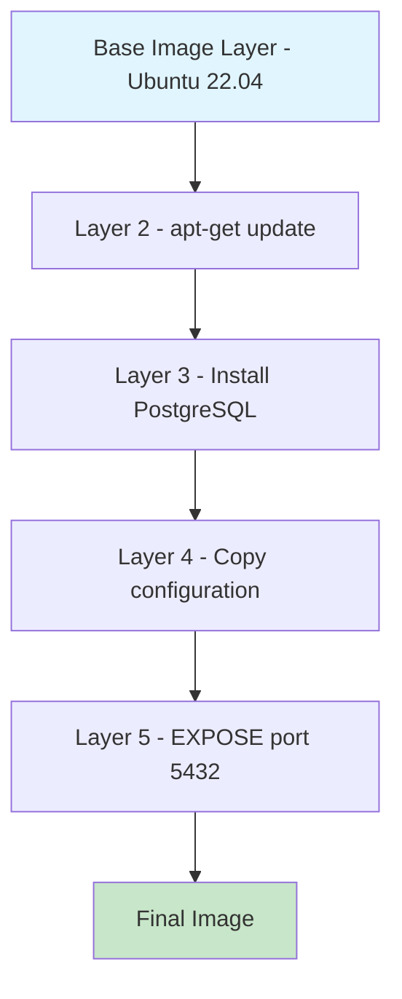
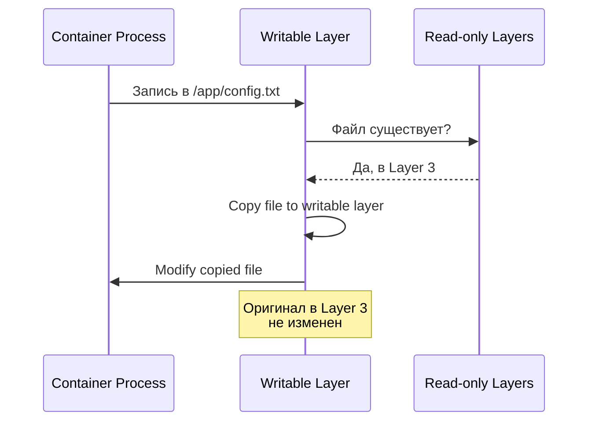
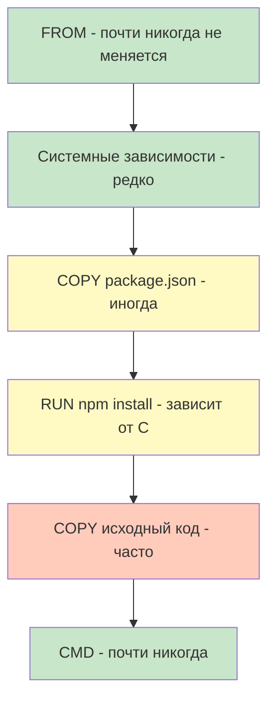
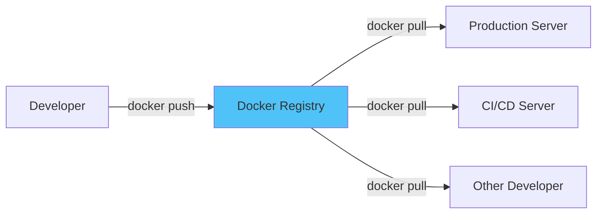

## Слоистая файловая система (Layered File System)

### Архитектура образов Docker

Docker образы построены на концепции **слоев (layers)**. Каждый слой представляет собой набор изменений файловой системы, и все слои вместе формируют финальный образ.



#### Ключевые концепции

**Read-only слои образа:**
- Каждая инструкция в Dockerfile создает новый слой
- Слои образа неизменяемы (immutable)
- Слои переиспользуются между образами
- Кэширование слоев ускоряет сборку

**Writable Container Layer:**
- Когда создается контейнер, поверх образа добавляется writable слой
- Все изменения в контейнере происходят в этом слое
- При удалении контейнера этот слой удаляется

```
┌─────────────────────────────────────────┐
│         Container Layer (R/W)           │  ← Изменения контейнера
├─────────────────────────────────────────┤
│         Image Layer 5 (R/O)             │
├─────────────────────────────────────────┤
│         Image Layer 4 (R/O)             │
├─────────────────────────────────────────┤
│         Image Layer 3 (R/O)             │
├─────────────────────────────────────────┤
│         Image Layer 2 (R/O)             │
├─────────────────────────────────────────┤
│         Image Layer 1 (R/O)             │  ← Base image
└─────────────────────────────────────────┘
```

### Union File System (UnionFS)

Docker использует Union File System для объединения слоев в единую файловую систему.

**Как работает UnionFS:**

```bash
# Представим 3 слоя:
# Layer 1: /app/file1.txt (содержит: "Hello")
# Layer 2: /app/file2.txt (содержит: "World")
# Layer 3: /app/file1.txt (содержит: "Hi Docker")

# В финальной файловой системе:
/app/file1.txt → "Hi Docker"  # из Layer 3 (перезаписал Layer 1)
/app/file2.txt → "World"       # из Layer 2
```

**Copy-on-Write (CoW) стратегия:**

Когда вы модифицируете файл в контейнере:
1. Docker ищет файл начиная с верхнего слоя
2. Если файл найден в нижнем read-only слое
3. Копирует его в writable container layer
4. Модификация происходит в копии



### Storage Drivers

Docker поддерживает различные storage drivers для реализации слоистой файловой системы:

| Driver | Описание | Использование |
|--------|----------|---------------|
| **overlay2** | Современный и рекомендуемый | Linux (default) |
| **aufs** | Старый, но стабильный | Ubuntu (legacy) |
| **devicemapper** | Для старых ядер | RHEL/CentOS 7 |
| **btrfs** | Использует btrfs | Специфичные случаи |
| **zfs** | Использует ZFS | Solaris, некоторые Linux |

:::tip Рекомендация
Для современных систем используйте **overlay2** - он предлагает лучшую производительность и надежность.
:::

**Проверка текущего storage driver:**

```bash
docker info | grep "Storage Driver"
# Вывод: Storage Driver: overlay2
```

### Исследование слоев образа

**Практический пример:**

```bash
# Скачаем образ PostgreSQL
docker pull postgres:15-alpine

# Посмотрим историю слоев
docker history postgres:15-alpine

# Вывод:
# IMAGE          CREATED       CREATED BY                                      SIZE
# 8a3c6c4a5e8f   2 weeks ago   /bin/sh -c #(nop)  CMD ["postgres"]            0B
# <missing>      2 weeks ago   /bin/sh -c #(nop)  EXPOSE 5432                 0B
# <missing>      2 weeks ago   /bin/sh -c #(nop)  VOLUME [/var/lib/postgre…   0B
# <missing>      2 weeks ago   /bin/sh -c mkdir -p /var/run/postgresql && …   62.2MB
# <missing>      2 weeks ago   /bin/sh -c apk add --no-cache postgresql15     0B
# ...
```

**Детальная информация об образе:**

```bash
# Inspect покажет все слои
docker inspect postgres:15-alpine

# Извлечь только ID слоев
docker inspect -f '{{range .RootFS.Layers}}{{println .}}{{end}}' postgres:15-alpine
```

### Почему слои важны?

**Преимущества:**

1. **Эффективное использование места:**
```bash
# Образ nginx:alpine (base)
docker pull nginx:alpine
# Size: 23.5MB

# Ваш кастомный образ на основе nginx:alpine
FROM nginx:alpine
COPY custom.conf /etc/nginx/
# Дополнительно: только размер custom.conf (несколько KB)
# Слои nginx:alpine переиспользуются!
```

2. **Быстрая сборка через кэширование:**
```dockerfile
# Если эти слои не изменились, Docker использует кэш
FROM node:18-alpine
WORKDIR /app
COPY package*.json ./
RUN npm install        # ← Долгая операция, но кэшируется!

# Только этот слой пересобирается при изменении кода
COPY . .               # ← Изменения здесь
```

3. **Эффективная доставка образов:**
```bash
# При push/pull только новые слои передаются
docker push myapp:v1.0  # Передаются все слои
docker push myapp:v1.1  # Только измененные слои!
```

:::warning Важно понимать
Каждая инструкция в Dockerfile создает новый слой. Оптимизация количества и размера слоев критична для производительности.
:::

## Основы Dockerfile

### Что такое Dockerfile?

**Dockerfile** - это текстовый файл с инструкциями для автоматической сборки Docker образа.

**Основная структура:**

```dockerfile
# Комментарий
ИНСТРУКЦИЯ аргументы

# Пример
FROM ubuntu:22.04
RUN apt-get update
CMD ["echo", "Hello Docker"]
```

### Основные инструкции Dockerfile

#### FROM - Базовый образ

Каждый Dockerfile должен начинаться с `FROM` (кроме парсерских директив и ARG до FROM).

```dockerfile
# Синтаксис
FROM <image>
FROM <image>:<tag>
FROM <image>@<digest>

# Примеры
FROM ubuntu:22.04
FROM node:18-alpine
FROM postgres:15
FROM scratch  # Пустой образ для создания минимальных образов
```

:::info Multi-stage builds
Можно использовать несколько `FROM` инструкций для multi-stage builds (подробнее позже).
:::

#### RUN - Выполнение команд

Выполняет команды при сборке образа и создает новый слой.

```dockerfile
# Shell form (выполняется в /bin/sh -c)
RUN apt-get update
RUN apt-get install -y postgresql

# Exec form (рекомендуется)
RUN ["apt-get", "update"]
RUN ["apt-get", "install", "-y", "postgresql"]

# Многострочная команда (лучшая практика)
RUN apt-get update && \
    apt-get install -y \
        postgresql-15 \
        postgresql-contrib \
        postgresql-client && \
    rm -rf /var/lib/apt/lists/*
```

:::tip Best Practice
Объединяйте связанные команды в один `RUN` для уменьшения количества слоев:
```dockerfile
# ❌ Плохо - 3 слоя
RUN apt-get update
RUN apt-get install -y curl
RUN rm -rf /var/lib/apt/lists/*

# ✅ Хорошо - 1 слой
RUN apt-get update && \
    apt-get install -y curl && \
    rm -rf /var/lib/apt/lists/*
```
:::

#### COPY и ADD - Копирование файлов

```dockerfile
# COPY - простое копирование файлов
COPY <src> <dest>
COPY package.json /app/
COPY src/ /app/src/
COPY --chown=postgres:postgres config.conf /etc/postgresql/

# ADD - с дополнительными возможностями
ADD <src> <dest>
ADD archive.tar.gz /app/  # Автоматически распаковывает
ADD https://example.com/file.txt /app/  # Скачивает из URL
```

:::warning COPY vs ADD
**Используйте COPY** вместо ADD, если не нужны дополнительные возможности ADD. COPY более предсказуем.
:::

#### WORKDIR - Рабочая директория

```dockerfile
# Устанавливает рабочую директорию
WORKDIR /path/to/workdir

# Пример
WORKDIR /app
COPY . .
RUN npm install

# Создает директорию если не существует
WORKDIR /app/src/components  # Создаст всю цепочку
```

#### ENV - Переменные окружения

```dockerfile
# Синтаксис
ENV <key>=<value>
ENV <key1>=<value1> <key2>=<value2>

# Примеры
ENV NODE_ENV=production
ENV POSTGRES_VERSION=15 \
    POSTGRES_USER=postgres \
    POSTGRES_DB=myapp

# Использование в Dockerfile
ENV APP_DIR=/app
WORKDIR $APP_DIR
COPY package.json $APP_DIR/
```

#### EXPOSE - Объявление портов

```dockerfile
# Документирует какие порты использует контейнер
EXPOSE <port> [<port>/<protocol>...]

# Примеры
EXPOSE 80
EXPOSE 443
EXPOSE 5432/tcp
EXPOSE 8080 8443
```

:::info Важно
`EXPOSE` **не публикует** порт! Это только документация. Для публикации используйте `-p` при запуске контейнера.
:::

#### CMD - Команда по умолчанию

Определяет команду, которая выполнится при запуске контейнера.

```dockerfile
# Exec form (предпочтительно)
CMD ["executable", "param1", "param2"]
CMD ["nginx", "-g", "daemon off;"]

# Shell form
CMD command param1 param2
CMD nginx -g "daemon off;"

# Параметры для ENTRYPOINT
CMD ["param1", "param2"]
```

:::warning Только одна CMD
Если в Dockerfile несколько `CMD`, выполнится только последняя.
:::

#### ENTRYPOINT - Точка входа

Конфигурирует контейнер для запуска как исполняемый файл.

```dockerfile
# Exec form
ENTRYPOINT ["executable", "param1"]
ENTRYPOINT ["docker-entrypoint.sh"]

# Shell form
ENTRYPOINT command param1 param2
```

**Разница между CMD и ENTRYPOINT:**

```dockerfile
# Вариант 1: Только CMD
CMD ["echo", "Hello"]
# docker run myimage          → Hello
# docker run myimage ls       → ls (CMD заменена)

# Вариант 2: ENTRYPOINT + CMD
ENTRYPOINT ["echo"]
CMD ["Hello"]
# docker run myimage          → Hello
# docker run myimage World    → World (дополняет ENTRYPOINT)

# Вариант 3: ENTRYPOINT (exec form)
ENTRYPOINT ["nginx", "-g", "daemon off;"]
# docker run myimage          → запускает nginx
# docker run myimage bash     → ошибка! не может переопределить
```

:::tip Когда использовать что?
- **CMD** - когда команда может быть полностью заменена пользователем
- **ENTRYPOINT** - когда контейнер должен всегда запускать конкретную программу
- **ENTRYPOINT + CMD** - ENTRYPOINT для программы, CMD для параметров по умолчанию
:::

#### USER - Пользователь

```dockerfile
# Устанавливает пользователя для последующих инструкций
USER <user>[:<group>]
USER <UID>[:<GID>]

# Примеры
USER postgres
USER node:node
USER 1001:1001

# Создание пользователя и переключение
RUN groupadd -r postgres && useradd -r -g postgres postgres
USER postgres
```

#### ARG - Build-time переменные

```dockerfile
# Определение переменной для времени сборки
ARG <name>[=<default value>]

# Примеры
ARG VERSION=latest
ARG BUILD_DATE
ARG POSTGRES_VERSION=15

# Использование
FROM postgres:${POSTGRES_VERSION}
LABEL build-date=${BUILD_DATE}

# При сборке
# docker build --build-arg VERSION=1.0 --build-arg BUILD_DATE=$(date) .
```

**ARG vs ENV:**

```dockerfile
# ARG - только во время сборки
ARG VERSION=1.0
RUN echo "Building version ${VERSION}"
# В контейнере VERSION не будет доступна!

# ENV - во время сборки И в контейнере
ENV VERSION=1.0
RUN echo "Building version ${VERSION}"
# В контейнере VERSION доступна!
```

#### VOLUME - Точки монтирования

```dockerfile
# Создает точку монтирования для volume
VOLUME ["/data"]
VOLUME ["/var/log", "/var/db"]

# Пример для PostgreSQL
VOLUME /var/lib/postgresql/data
```

#### LABEL - Метаданные

```dockerfile
# Добавление метаданных к образу
LABEL <key>=<value> <key>=<value> ...

# Примеры
LABEL version="1.0"
LABEL description="PostgreSQL database with custom configuration"
LABEL maintainer="your-email@example.com"
LABEL org.opencontainers.image.created="2024-01-15"
LABEL org.opencontainers.image.authors="Your Name"

# Многострочный формат
LABEL com.example.version="1.0" \
      com.example.release-date="2024-01-15" \
      com.example.description="Production PostgreSQL"
```

#### HEALTHCHECK - Проверка здоровья

```dockerfile
# Синтаксис
HEALTHCHECK [OPTIONS] CMD command
HEALTHCHECK NONE  # Отключить healthcheck

# Опции:
# --interval=DURATION (default: 30s)
# --timeout=DURATION (default: 30s)
# --start-period=DURATION (default: 0s)
# --retries=N (default: 3)

# Примеры
HEALTHCHECK --interval=30s --timeout=3s \
  CMD pg_isready -U postgres || exit 1

HEALTHCHECK --interval=5m --timeout=3s \
  CMD curl -f http://localhost/ || exit 1
```

### Полный пример Dockerfile для Node.js приложения

```docker title="Dockerfile"
# Парсерская директива (должна быть в самом начале)
# syntax=docker/dockerfile:1

# Build-time переменные
ARG NODE_VERSION=18
ARG APP_DIR=/usr/src/app

# Базовый образ
FROM node:${NODE_VERSION}-alpine

# Метаданные
LABEL maintainer="developer@example.com" \
      version="1.0" \
      description="Node.js application with PostgreSQL"

# Переменные окружения
ENV NODE_ENV=production \
    PORT=3000

# Рабочая директория
WORKDIR ${APP_DIR}

# Установка системных зависимостей
RUN apk add --no-cache \
    postgresql-client \
    curl

# Копирование package files и установка зависимостей
# (отдельный слой для кэширования)
COPY package*.json ./
RUN npm ci --only=production && \
    npm cache clean --force

# Копирование исходного кода
COPY . .

# Создание непривилегированного пользователя
RUN addgroup -g 1001 -S nodejs && \
    adduser -S nodejs -u 1001 && \
    chown -R nodejs:nodejs ${APP_DIR}

# Переключение на непривилегированного пользователя
USER nodejs

# Экспонирование порта
EXPOSE ${PORT}

# Health check
HEALTHCHECK --interval=30s --timeout=3s --start-period=5s --retries=3 \
  CMD node healthcheck.js || exit 1

# Команда запуска
CMD ["node", "server.js"]
```

## Создание образов - от простого к сложному

### Простой образ - Static website

```dockerfile title="Dockerfile"
FROM nginx:alpine

# Копируем статические файлы
COPY index.html /usr/share/nginx/html/
COPY css/ /usr/share/nginx/html/css/
COPY js/ /usr/share/nginx/html/js/
COPY images/ /usr/share/nginx/html/images/

# Экспонируем порт
EXPOSE 80

# Nginx уже имеет CMD, поэтому не нужно переопределять
```

**Сборка и запуск:**

```bash
# Сборка
docker build -t my-website:v1.0 .

# Запуск
docker run -d -p 8080:80 --name website my-website:v1.0

# Проверка
curl http://localhost:8080
```

### Python приложение с зависимостями

```dockerfile title="Dockerfile"
FROM python:3.11-slim

# Установка системных зависимостей
RUN apt-get update && \
    apt-get install -y --no-install-recommends \
        gcc \
        postgresql-client \
        libpq-dev && \
    rm -rf /var/lib/apt/lists/*

# Рабочая директория
WORKDIR /app

# Копирование и установка Python зависимостей
COPY requirements.txt .
RUN pip install --no-cache-dir -r requirements.txt

# Копирование приложения
COPY . .

# Создание пользователя
RUN useradd -m -u 1000 appuser && \
    chown -R appuser:appuser /app
USER appuser

# Переменные окружения
ENV PYTHONUNBUFFERED=1 \
    PYTHONDONTWRITEBYTECODE=1

EXPOSE 8000

CMD ["python", "app.py"]
```

**requirements.txt:**
```txt title="requirements.txt"
Flask==3.0.0
psycopg2-binary==2.9.9
gunicorn==21.2.0
python-dotenv==1.0.0
```

### PostgreSQL с кастомной конфигурацией

```dockerfile title="Dockerfile"
FROM postgres:15-alpine

# Переменные окружения для PostgreSQL
ENV POSTGRES_DB=myapp \
    POSTGRES_USER=dbuser \
    POSTGRES_PASSWORD=changeme \
    PGDATA=/var/lib/postgresql/data/pgdata

# Копирование кастомной конфигурации
COPY postgresql.conf /etc/postgresql/postgresql.conf
COPY pg_hba.conf /etc/postgresql/pg_hba.conf

# Копирование init скриптов
COPY init-scripts/ /docker-entrypoint-initdb.d/

# Создание директорий для данных
RUN mkdir -p /var/lib/postgresql/data/pgdata && \
    chown -R postgres:postgres /var/lib/postgresql

# Volume для персистентности данных
VOLUME /var/lib/postgresql/data

EXPOSE 5432

# PostgreSQL образ уже имеет ENTRYPOINT и CMD
# Переопределим CMD для использования кастомной конфигурации
CMD ["postgres", "-c", "config_file=/etc/postgresql/postgresql.conf"]
```

**Инициализационный скрипт:**

```sql title="init-scripts/01-create-schema.sql"
-- Этот скрипт выполнится при первом запуске

CREATE TABLE IF NOT EXISTS users (
    id SERIAL PRIMARY KEY,
    username VARCHAR(50) UNIQUE NOT NULL,
    email VARCHAR(100) UNIQUE NOT NULL,
    created_at TIMESTAMP DEFAULT CURRENT_TIMESTAMP
);

CREATE TABLE IF NOT EXISTS posts (
    id SERIAL PRIMARY KEY,
    user_id INTEGER REFERENCES users(id),
    title VARCHAR(200) NOT NULL,
    content TEXT,
    created_at TIMESTAMP DEFAULT CURRENT_TIMESTAMP
);

CREATE INDEX idx_posts_user_id ON posts(user_id);

-- Вставка тестовых данных
INSERT INTO users (username, email) VALUES
    ('alice', 'alice@example.com'),
    ('bob', 'bob@example.com');
```

```bash title="init-scripts/02-permissions.sh"
#!/bin/bash
set -e

psql -v ON_ERROR_STOP=1 --username "$POSTGRES_USER" --dbname "$POSTGRES_DB" <<-EOSQL
    -- Создание дополнительного пользователя для приложения
    CREATE USER app_user WITH PASSWORD 'app_password';
    GRANT CONNECT ON DATABASE myapp TO app_user;
    GRANT USAGE ON SCHEMA public TO app_user;
    GRANT SELECT, INSERT, UPDATE, DELETE ON ALL TABLES IN SCHEMA public TO app_user;
    GRANT USAGE, SELECT ON ALL SEQUENCES IN SCHEMA public TO app_user;
    
    -- Права по умолчанию для будущих таблиц
    ALTER DEFAULT PRIVILEGES IN SCHEMA public 
    GRANT SELECT, INSERT, UPDATE, DELETE ON TABLES TO app_user;
    
    ALTER DEFAULT PRIVILEGES IN SCHEMA public 
    GRANT USAGE, SELECT ON SEQUENCES TO app_user;
EOSQL
```

**Кастомная конфигурация PostgreSQL:**

```conf title="postgresql.conf"
# Базовые настройки
listen_addresses = '*'
max_connections = 100
shared_buffers = 256MB

# Логирование
logging_collector = on
log_directory = 'pg_log'
log_filename = 'postgresql-%Y-%m-%d_%H%M%S.log'
log_statement = 'mod'
log_min_duration_statement = 1000

# Performance
effective_cache_size = 1GB
maintenance_work_mem = 64MB
checkpoint_completion_target = 0.9
wal_buffers = 16MB
default_statistics_target = 100
random_page_cost = 1.1
```

```conf title="pg_hba.conf"
# TYPE  DATABASE        USER            ADDRESS                 METHOD

# "local" для Unix domain socket соединений
local   all             all                                     trust

# IPv4 local connections:
host    all             all             127.0.0.1/32            md5

# IPv6 local connections:
host    all             all             ::1/128                 md5

# Разрешить соединения из Docker network
host    all             all             0.0.0.0/0               md5
host    all             all             ::/0                    md5
```

**Сборка и запуск:**

```bash
# Структура проекта
postgres-custom/
├── Dockerfile
├── postgresql.conf
├── pg_hba.conf
└── init-scripts/
    ├── 01-create-schema.sql
    └── 02-permissions.sh

# Сборка образа
docker build -t my-postgres:15-custom .

# Запуск контейнера
docker run -d \
  --name postgres-db \
  -e POSTGRES_PASSWORD=securepassword \
  -p 5432:5432 \
  -v postgres-data:/var/lib/postgresql/data \
  my-postgres:15-custom

# Проверка логов
docker logs postgres-db

# Подключение к базе
docker exec -it postgres-db psql -U dbuser -d myapp

# Внутри psql:
\dt              # Список таблиц
SELECT * FROM users;
\du              # Список пользователей
```

### Full-stack приложение (Node.js + PostgreSQL)

**Структура проекта:**
```
fullstack-app/
├── backend/
│   ├── Dockerfile
│   ├── package.json
│   ├── server.js
│   └── ...
├── frontend/
│   ├── Dockerfile
│   ├── package.json
│   ├── src/
│   └── ...
├── postgres/
│   ├── Dockerfile
│   └── init-scripts/
└── docker-compose.yml
```

**Backend Dockerfile:**

```dockerfile title="backend/Dockerfile"
FROM node:18-alpine

# Установка PostgreSQL клиента для health checks
RUN apk add --no-cache postgresql-client

WORKDIR /app

# Копирование зависимостей
COPY package*.json ./
RUN npm ci --only=production

# Копирование кода
COPY . .

# Пользователь
RUN addgroup -g 1001 -S nodejs && \
    adduser -S nodejs -u 1001 && \
    chown -R nodejs:nodejs /app
USER nodejs

EXPOSE 3000

# Healthcheck
HEALTHCHECK --interval=30s --timeout=3s \
  CMD node -e "require('http').get('http://localhost:3000/health', (res) => { process.exit(res.statusCode === 200 ? 0 : 1); })" || exit 1

CMD ["node", "server.js"]
```

**Frontend Dockerfile:**

```dockerfile title="frontend/Dockerfile"
# Build stage
FROM node:18-alpine AS builder

WORKDIR /app

COPY package*.json ./
RUN npm ci

COPY . .
RUN npm run build

# Production stage
FROM nginx:alpine

# Копирование собранных файлов из builder
COPY --from=builder /app/build /usr/share/nginx/html

# Кастомная конфигурация nginx
COPY nginx.conf /etc/nginx/conf.d/default.conf

EXPOSE 80

CMD ["nginx", "-g", "daemon off;"]
```

**Docker Compose для связывания:**

```yaml title="docker-compose.yml"
version: '3.8'

services:
  postgres:
    build: ./postgres
    environment:
      POSTGRES_DB: myapp
      POSTGRES_USER: dbuser
      POSTGRES_PASSWORD: ${DB_PASSWORD:-changeme}
    volumes:
      - postgres-data:/var/lib/postgresql/data
    ports:
      - "5432:5432"
    healthcheck:
      test: ["CMD-SHELL", "pg_isready -U dbuser -d myapp"]
      interval: 10s
      timeout: 5s
      retries: 5

  backend:
    build: ./backend
    depends_on:
      postgres:
        condition: service_healthy
    environment:
      DATABASE_URL: postgresql://dbuser:${DB_PASSWORD:-changeme}@postgres:5432/myapp
      NODE_ENV: production
    ports:
      - "3000:3000"
    restart: unless-stopped

  frontend:
    build: ./frontend
    depends_on:
      - backend
    ports:
      - "80:80"
    restart: unless-stopped

volumes:
  postgres-data:
```

## Оптимизация образов Docker

### Почему важна оптимизация?

**Проблемы больших образов:**
- Медленная загрузка и выгрузка
- Больше места в registry
- Увеличенная поверхность атаки (больше уязвимостей)
- Медленное развертывание
- Дорогой трафик

**Цели оптимизации:**
- Уменьшить размер образа
- Ускорить сборку
- Повысить безопасность
- Улучшить кэширование

### Выбор базового образа

**Сравнение размеров:**

```bash
# Полные образы
docker pull ubuntu:22.04         # ~77 MB
docker pull node:18              # ~1.1 GB
docker pull postgres:15          # ~379 MB

# Slim варианты
docker pull node:18-slim         # ~244 MB
docker pull postgres:15-slim     # ~224 MB (не существует, это пример)

# Alpine варианты
docker pull node:18-alpine       # ~174 MB
docker pull postgres:15-alpine   # ~238 MB
docker pull alpine:3.19          # ~7.3 MB
```

:::tip Выбор базового образа
| Образ | Размер | Использование |
|-------|--------|---------------|
| **alpine** | Минимальный (5-10 MB) | Production, микросервисы |
| **slim** | Средний (~100-300 MB) | Когда нужны стандартные библиотеки |
| **full** | Большой (500 MB+) | Разработка, когда нужны инструменты |
| **distroless** | Очень маленький | Production, максимальная безопасность |
| **scratch** | 0 MB | Статические бинарники (Go, Rust) |
:::

**Пример сравнения:**

```dockerfile title="Dockerfile.full"
FROM node:18
WORKDIR /app
COPY package*.json ./
RUN npm install
COPY . .
CMD ["node", "server.js"]

# Размер: ~1.1 GB
```

```dockerfile title="Dockerfile.alpine"
FROM node:18-alpine
WORKDIR /app
COPY package*.json ./
RUN npm ci --only=production
COPY . .
CMD ["node", "server.js"]

# Размер: ~180 MB (в 6 раз меньше!)
```

### Минимизация количества слоев

**❌ Плохо - много слоев:**

```dockerfile
FROM ubuntu:22.04

RUN apt-get update
RUN apt-get install -y curl
RUN apt-get install -y wget
RUN apt-get install -y git
RUN apt-get install -y vim
RUN rm -rf /var/lib/apt/lists/*

# 6 RUN инструкций = 6 слоев
```

**✅ Хорошо - объединенные команды:**

```dockerfile
FROM ubuntu:22.04

RUN apt-get update && \
    apt-get install -y \
        curl \
        wget \
        git \
        vim && \
    rm -rf /var/lib/apt/lists/*

# 1 RUN инструкция = 1 слой
```

### Очистка в том же слое

**❌ Плохо - очистка в другом слое:**

```dockerfile
FROM python:3.11

# Этот слой содержит кэш apt
RUN apt-get update && \
    apt-get install -y build-essential

# Очистка в другом слое не уменьшает предыдущий слой!
RUN rm -rf /var/lib/apt/lists/*
```

**✅ Хорошо - очистка в том же слое:**

```dockerfile
FROM python:3.11

# Установка и очистка в одной инструкции
RUN apt-get update && \
    apt-get install -y build-essential && \
    rm -rf /var/lib/apt/lists/*
```

### Использование .dockerignore

Файл `.dockerignore` работает как `.gitignore` - исключает файлы из build context.

```txt title=".dockerignore"
# Git файлы
.git
.gitignore
.gitattributes

# Документация
README.md
CHANGELOG.md
docs/
*.md

# Зависимости (будут установлены в образе)
node_modules/
npm-debug.log
package-lock.json

# Python
__pycache__/
*.py[cod]
*$py.class
*.so
.Python
venv/
env/
.env

# IDE
.vscode/
.idea/
*.swp
*.swo
*~

# Тесты
tests/
*.test.js
coverage/

# CI/CD
.github/
.gitlab-ci.yml
Jenkinsfile

# Docker
Dockerfile*
docker-compose*.yml
.dockerignore

# Логи
logs/
*.log

# Временные файлы
tmp/
temp/
*.tmp

# OS файлы
.DS_Store
Thumbs.db
```

**Пример влияния:**

```bash
# Без .dockerignore
Sending build context to Docker daemon  523.4MB

# С .dockerignore
Sending build context to Docker daemon  12.3MB
```

### Порядок инструкций для кэширования

Docker кэширует слои. Если файл не изменился, слой переиспользуется.

**❌ Плохо - кэш часто инвалидируется:**

```dockerfile
FROM node:18-alpine
WORKDIR /app

# Копируем весь код сразу
COPY . .

# При изменении ЛЮБОГО файла, npm install выполнится заново!
RUN npm install

CMD ["node", "server.js"]
```

**✅ Хорошо - оптимизировано для кэша:**

```dockerfile
FROM node:18-alpine
WORKDIR /app

# Сначала копируем только package files
COPY package*.json ./

# npm install кэшируется, если package.json не изменился
RUN npm ci --only=production

# Теперь копируем код
# Изменения кода не влияют на слой с зависимостями
COPY . .

CMD ["node", "server.js"]
```

**Правило:** Располагайте инструкции от **менее часто изменяемых** к **более часто изменяемым**.



### Multi-stage builds

Multi-stage builds позволяют использовать несколько `FROM` в одном Dockerfile для создания промежуточных образов.

**Проблема без multi-stage:**

```dockerfile
FROM node:18

WORKDIR /app
COPY package*.json ./
RUN npm install  # Включает devDependencies!
COPY . .
RUN npm run build  # Для сборки нужны devDependencies

CMD ["node", "dist/server.js"]

# Результат: образ содержит devDependencies, исходники,
# build tools - все ненужное в production!
# Размер: ~600 MB
```

**✅ С multi-stage:**

```dockerfile
# ============ Stage 1: Build ============
FROM node:18 AS builder

WORKDIR /app

# Установка всех зависимостей (включая dev)
COPY package*.json ./
RUN npm install

# Копирование и сборка
COPY . .
RUN npm run build

# ============ Stage 2: Production ============
FROM node:18-alpine

WORKDIR /app

# Установка только production зависимостей
COPY package*.json ./
RUN npm ci --only=production

# Копирование только собранного кода из builder
COPY --from=builder /app/dist ./dist

# Пользователь
RUN addgroup -g 1001 nodejs && \
    adduser -S nodejs -u 1001
USER nodejs

CMD ["node", "dist/server.js"]

# Результат: только production код и зависимости
# Размер: ~180 MB (в 3+ раза меньше!)
```

**Еще пример - Go приложение:**

```dockerfile
# ============ Build stage ============
FROM golang:1.21-alpine AS builder

WORKDIR /app

# Копирование go.mod и go.sum для кэширования зависимостей
COPY go.mod go.sum ./
RUN go mod download

# Копирование кода и сборка
COPY . .
RUN CGO_ENABLED=0 GOOS=linux go build -a -installsuffix cgo -o main .

# ============ Production stage ============
FROM scratch

# Копирование только бинарника
COPY --from=builder /app/main /main

# Копирование CA сертификатов для HTTPS
COPY --from=builder /etc/ssl/certs/ca-certificates.crt /etc/ssl/certs/

EXPOSE 8080
CMD ["/main"]

# Размер: ~10-15 MB для полного приложения!
```

**Python пример с multi-stage:**

```dockerfile
# ============ Build stage ============
FROM python:3.11 AS builder

WORKDIR /app

# Установка зависимостей сборки
RUN apt-get update && \
    apt-get install -y --no-install-recommends \
        build-essential \
        libpq-dev && \
    pip install --upgrade pip

# Копирование и установка Python пакетов
COPY requirements.txt .
RUN pip install --user --no-cache-dir -r requirements.txt

# ============ Production stage ============
FROM python:3.11-slim

WORKDIR /app

# Установка только runtime зависимостей
RUN apt-get update && \
    apt-get install -y --no-install-recommends \
        libpq5 && \
    rm -rf /var/lib/apt/lists/*

# Копирование установленных пакетов из builder
COPY --from=builder /root/.local /root/.local

# Копирование кода приложения
COPY . .

# PATH для пакетов
ENV PATH=/root/.local/bin:$PATH

CMD ["python", "app.py"]
```

### Использование конкретных версий

**❌ Плохо - latest теги:**

```dockerfile
FROM node:latest
RUN npm install express
```

Проблемы:
- Непредсказуемое поведение
- Разные образы в dev/prod
- Сложно откатиться

**✅ Хорошо - конкретные версии:**

```dockerfile
FROM node:18.19.0-alpine3.19
RUN npm install express@4.18.2
```

### Удаление ненужных файлов

**Пример для Python:**

```dockerfile
FROM python:3.11-slim

WORKDIR /app

# Установка зависимостей
COPY requirements.txt .
RUN pip install --no-cache-dir -r requirements.txt && \
    # Удаление кэша pip
    rm -rf /root/.cache/pip && \
    # Удаление *.pyc файлов
    find /usr/local/lib/python3.11 -name '*.pyc' -delete && \
    # Удаление тестов из пакетов
    find /usr/local/lib/python3.11 -name 'tests' -type d -exec rm -rf {} + 2>/dev/null || true

COPY . .

CMD ["python", "app.py"]
```

**Пример для Node.js:**

```dockerfile
FROM node:18-alpine

WORKDIR /app

COPY package*.json ./
RUN npm ci --only=production && \
    # Очистка npm кэша
    npm cache clean --force && \
    # Удаление ненужных файлов
    rm -rf /tmp/* /root/.npm

COPY . .

CMD ["node", "server.js"]
```

### Сравнение оптимизаций

Давайте создадим и сравним разные версии одного образа:

```dockerfile title="Dockerfile.unoptimized"
FROM node:18

WORKDIR /app
COPY . .
RUN npm install
RUN npm run build

CMD ["node", "dist/server.js"]
```

```bash
docker build -f Dockerfile.unoptimized -t app:unoptimized .
# Size: 1.15 GB
```

```dockerfile title="Dockerfile.optimized"
# Build stage
FROM node:18-alpine AS builder
WORKDIR /app
COPY package*.json ./
RUN npm install
COPY . .
RUN npm run build

# Production stage
FROM node:18-alpine
WORKDIR /app
COPY package*.json ./
RUN npm ci --only=production && \
    npm cache clean --force
COPY --from=builder /app/dist ./dist
RUN addgroup -g 1001 nodejs && \
    adduser -S nodejs -u 1001 && \
    chown -R nodejs:nodejs /app
USER nodejs

CMD ["node", "dist/server.js"]
```

```bash
docker build -f Dockerfile.optimized -t app:optimized .
# Size: 185 MB (в 6+ раз меньше!)
```

**Итоговая таблица:**

| Метод | Экономия размера | Сложность |
|-------|------------------|-----------|
| Alpine вместо full | ~70-80% | Низкая |
| Multi-stage builds | ~50-70% | Средняя |
| .dockerignore | ~10-30% | Низкая |
| Объединение RUN | ~5-15% | Низкая |
| Очистка в слое | ~10-20% | Низкая |
| npm ci вместо install | ~5-10% | Низкая |

## Docker Hub и Registry

### Что такое Docker Registry?

**Docker Registry** - это система хранения и распространения Docker образов.



**Типы Registry:**
- **Docker Hub** - публичный registry от Docker
- **Private Registry** - собственный registry
- **Cloud Providers** - AWS ECR, Google GCR, Azure ACR
- **Self-hosted** - Harbor, GitLab Container Registry

### Docker Hub

**Основные возможности:**
- Бесплатные публичные репозитории (unlimited)
- Приватные репозитории (ограниченное количество бесплатно)
- Automated builds
- Webhooks
- Organizations и teams

**Создание аккаунта:**
1. Перейти на https://hub.docker.com
2. Зарегистрироваться
3. Подтвердить email

### Работа с Docker Hub

#### Вход в Docker Hub

```bash
# Вход
docker login
# Введите username и password

# Вход с указанием registry
docker login registry.example.com

# Вход с credentials
echo "PASSWORD" | docker login -u USERNAME --password-stdin

# Проверка
cat ~/.docker/config.json

# Выход
docker logout
```

#### Именование образов

Формат: `[registry/][namespace/]repository[:tag]`

```bash
# Docker Hub (registry опущен)
nginx:latest
myusername/myapp:v1.0
organization/project:stable

# Полный формат
docker.io/library/nginx:latest
docker.io/myusername/myapp:v1.0

# Другой registry
gcr.io/my-project/app:latest
registry.company.com/team/service:v2.0
```

#### Push образа в Docker Hub

```bash
# 1. Собрать образ с правильным именем
docker build -t myusername/myapp:v1.0 .

# 2. (Опционально) Создать дополнительный тег
docker tag myusername/myapp:v1.0 myusername/myapp:latest

# 3. Push
docker push myusername/myapp:v1.0
docker push myusername/myapp:latest

# 4. Push всех тегов репозитория
docker push --all-tags myusername/myapp
```

**Пример с пошаговым выводом:**

```bash
$ docker push myusername/myapp:v1.0
The push refers to repository [docker.io/myusername/myapp]
a3f6d5e1c2b4: Pushed
8d3a9f2e4c5b: Pushed
1f4e2c3d5a6b: Mounted from library/node
v1.0: digest: sha256:abc123... size: 2417
```

#### Pull образа

```bash
# Pull с Docker Hub
docker pull myusername/myapp:v1.0

# Pull latest (по умолчанию)
docker pull myusername/myapp

# Pull с другого registry
docker pull gcr.io/my-project/app:latest

# Pull всех тегов
docker pull --all-tags myusername/myapp
```

### Теги и версионирование

**Best practices для тегирования:**

```bash
# ❌ Плохо - только latest
docker build -t myapp:latest .

# ✅ Хорошо - семантическое версионирование
docker build -t myapp:1.2.3 .
docker tag myapp:1.2.3 myapp:1.2
docker tag myapp:1.2.3 myapp:1
docker tag myapp:1.2.3 myapp:latest

# ✅ Хорошо - с git commit
GIT_COMMIT=$(git rev-parse --short HEAD)
docker build -t myapp:${GIT_COMMIT} .
docker tag myapp:${GIT_COMMIT} myapp:latest

# ✅ Хорошо - с датой и версией
DATE=$(date +%Y%m%d)
docker build -t myapp:v1.0-${DATE} .

# ✅ Хорошо - окружение в теге
docker tag myapp:1.2.3 myapp:1.2.3-production
docker tag myapp:1.2.3 myapp:1.2.3-staging
```

**Стратегия тегирования:**

| Тег | Использование | Пример |
|-----|---------------|--------|
| `latest` | Последняя версия | `myapp:latest` |
| `X.Y.Z` | Конкретная версия | `myapp:1.2.3` |
| `X.Y` | Minor версия | `myapp:1.2` |
| `X` | Major версия | `myapp:1` |
| `git-SHA` | Git commit | `myapp:a3f2c1d` |
| `env-version` | Окружение | `myapp:prod-1.2.3` |

### Приватный Docker Registry

#### Запуск локального Registry

```bash
# Запуск простого registry
docker run -d \
  -p 5000:5000 \
  --name registry \
  --restart=always \
  registry:2

# С persistent storage
docker run -d \
  -p 5000:5000 \
  --name registry \
  --restart=always \
  -v registry-data:/var/lib/registry \
  registry:2
```

#### Использование приватного registry

```bash
# Tag для приватного registry
docker tag myapp:latest localhost:5000/myapp:latest

# Push
docker push localhost:5000/myapp:latest

# Pull
docker pull localhost:5000/myapp:latest

# Список образов в registry
curl http://localhost:5000/v2/_catalog

# Список тегов
curl http://localhost:5000/v2/myapp/tags/list
```

#### Registry с аутентификацией

```bash
# Создание htpasswd файла
docker run --rm \
  --entrypoint htpasswd \
  httpd:2 -Bbn myuser mypassword > auth/htpasswd

# Запуск registry с auth
docker run -d \
  -p 5000:5000 \
  --name registry \
  --restart=always \
  -v $(pwd)/auth:/auth \
  -e "REGISTRY_AUTH=htpasswd" \
  -e "REGISTRY_AUTH_HTPASSWD_REALM=Registry Realm" \
  -e "REGISTRY_AUTH_HTPASSWD_PATH=/auth/htpasswd" \
  -v registry-data:/var/lib/registry \
  registry:2

# Вход
docker login localhost:5000
```

#### Registry с HTTPS

```bash
# Генерация self-signed сертификата
mkdir -p certs
openssl req -newkey rsa:4096 -nodes -sha256 \
  -keyout certs/domain.key -x509 -days 365 \
  -out certs/domain.crt \
  -subj "/CN=registry.example.com"

# Запуск с TLS
docker run -d \
  -p 443:443 \
  --name registry \
  --restart=always \
  -v $(pwd)/certs:/certs \
  -v registry-data:/var/lib/registry \
  -e "REGISTRY_HTTP_ADDR=0.0.0.0:443" \
  -e "REGISTRY_HTTP_TLS_CERTIFICATE=/certs/domain.crt" \
  -e "REGISTRY_HTTP_TLS_KEY=/certs/domain.key" \
  registry:2
```

### Harbor - Enterprise Registry

**Harbor** - open-source enterprise registry с расширенными возможностями.

**Возможности:**
- Role-based access control (RBAC)
- Vulnerability scanning
- Image signing и content trust
- Replication между registries
- Helm charts repository
- Web UI

**Установка Harbor:**

```bash
# Скачать Harbor
wget https://github.com/goharbor/harbor/releases/download/v2.10.0/harbor-offline-installer-v2.10.0.tgz

# Распаковать
tar xvf harbor-offline-installer-v2.10.0.tgz
cd harbor

# Настроить
cp harbor.yml.tmpl harbor.yml
vim harbor.yml
# Изменить hostname, admin password, и т.д.

# Установить
sudo ./install.sh
```

**Конфигурация:**

```yaml title="harbor.yml"
hostname: registry.mycompany.com

http:
  port: 80

https:
  port: 443
  certificate: /path/to/cert.crt
  private_key: /path/to/cert.key

harbor_admin_password: Harbor12345

database:
  password: root123

data_volume: /data

log:
  level: info
  local:
    rotate_count: 50
    rotate_size: 200M
    location: /var/log/harbor
```

**Использование Harbor:**

```bash
# Вход
docker login registry.mycompany.com

# Tag
docker tag myapp:v1.0 registry.mycompany.com/project/myapp:v1.0

# Push
docker push registry.mycompany.com/project/myapp:v1.0
```

### Cloud Registry примеры

#### AWS ECR (Elastic Container Registry)

```bash
# Аутентификация
aws ecr get-login-password --region us-east-1 | \
  docker login --username AWS --password-stdin \
  123456789012.dkr.ecr.us-east-1.amazonaws.com

# Создание репозитория
aws ecr create-repository --repository-name myapp

# Tag
docker tag myapp:v1.0 \
  123456789012.dkr.ecr.us-east-1.amazonaws.com/myapp:v1.0

# Push
docker push \
  123456789012.dkr.ecr.us-east-1.amazonaws.com/myapp:v1.0
```

#### Google Container Registry (GCR)

```bash
# Аутентификация
gcloud auth configure-docker

# Tag
docker tag myapp:v1.0 gcr.io/my-project/myapp:v1.0

# Push
docker push gcr.io/my-project/myapp:v1.0
```

#### Azure Container Registry (ACR)

```bash
# Создание registry
az acr create --resource-group myResourceGroup \
  --name myregistry --sku Basic

# Вход
az acr login --name myregistry

# Tag
docker tag myapp:v1.0 myregistry.azurecr.io/myapp:v1.0

# Push
docker push myregistry.azurecr.io/myapp:v1.0
```
